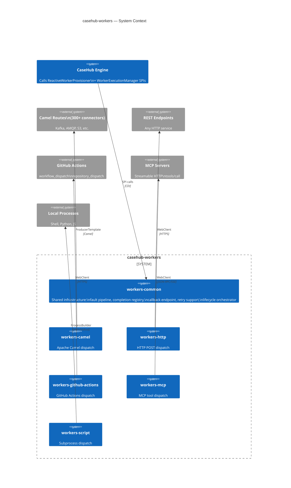
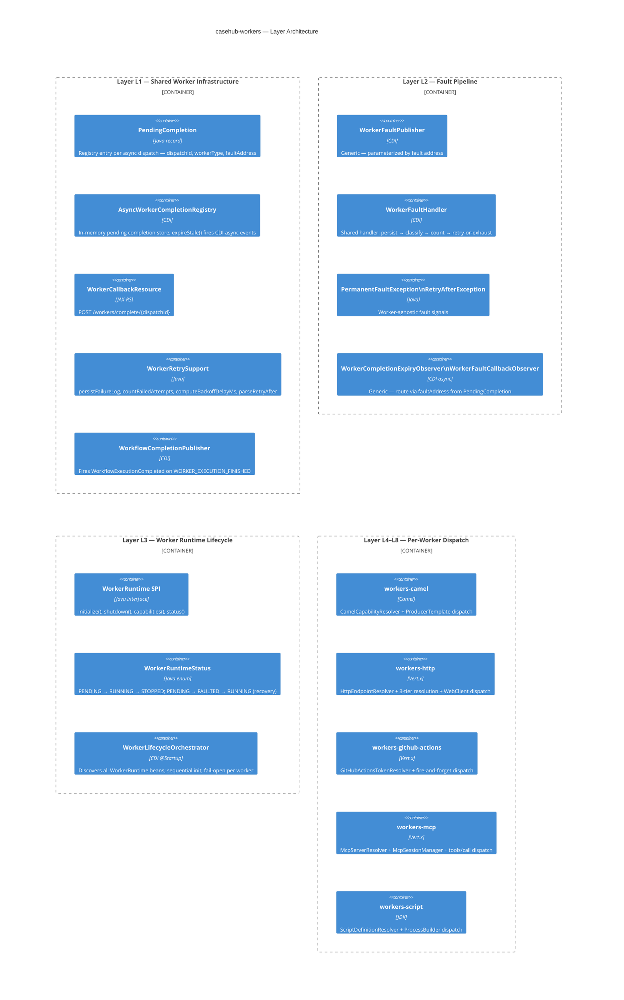
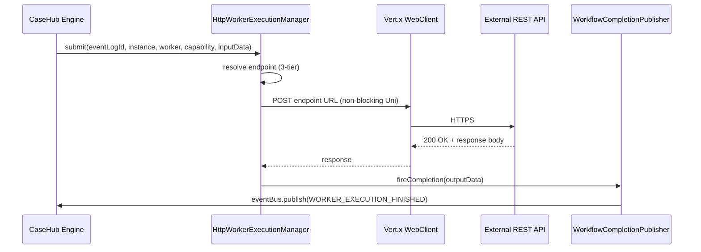
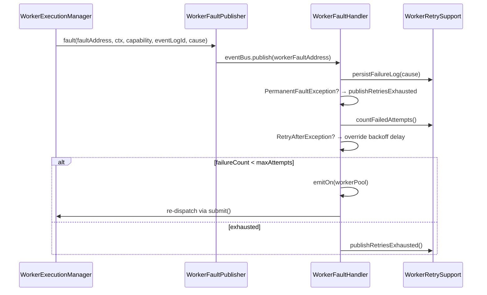
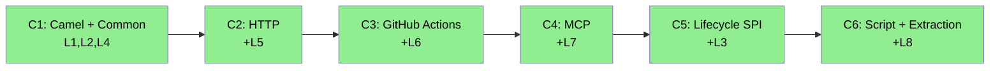

# casehub-workers — ARC42STORIES.MD

**Spec:** Arc42Stories v0.1
**Profile:** CaseHub — Foundation tier
**Profile ref:** `../parent/docs/arc42stories-casehub-profile.md` · fallback: `https://raw.githubusercontent.com/casehubio/parent/main/docs/arc42stories-casehub-profile.md`
**Build position:** Integration tier — after casehub-engine-api and casehub-engine-common
**Consumed by:** claudony, casehub-openclaw, and any application deploying external worker dispatch
**Depends on:** casehub-engine-api, casehub-engine-common, casehub-platform-api (HTTP worker only)
**Prefix:** W

---

## §1 Introduction and Goals

### Purpose

Integration-tier collection of CaseHub worker implementations. Each module provides `ReactiveWorkerProvisioner` and `WorkerExecutionManager` SPI implementations that allow CaseHub cases to dispatch work to external execution runtimes — HTTP endpoints, Apache Camel routes, GitHub Actions workflows, MCP server tools, and shell scripts.

**Design rule:** thin wrappers. Each worker translates a CaseHub case step dispatch into the target runtime's protocol and fires `WorkflowExecutionCompleted` on `WORKER_EXECUTION_FINISHED` when done. No domain logic here.

### Stakeholders

| Stakeholder | Concern |
|---|---|
| Case definition author | Reference a capability tag (e.g. `mcp:slack:send-message`) — the worker handles dispatch |
| Application deployer | Add a worker jar to the classpath — CDI activates the worker automatically |
| Worker implementor | Follow the established module pattern: constants, addresses, resolver, execution manager, provisioner, runtime, fault handler stub |

### Top Quality Goals

| Goal | Mechanism |
|---|---|
| Classpath activation | `@ApplicationScoped` — no config required to enable; CDI displaces `NoOp*` defaults |
| Stateless workers | All state in the case instance or external system; never in provisioner or execution manager beans |
| Shared fault infrastructure | `WorkerFaultPublisher` + `WorkerFaultHandler` in workers-common; per-module stubs are 5 lines |
| Worker runtime lifecycle | `WorkerRuntime` SPI — `initialize()`, `shutdown()`, `capabilities()`, `status()` |
| Protocol-correct completion | `eventBus.publish()` on `WORKER_EXECUTION_FINISHED` — never `request()`; two consumers exist |

### Artifact Schema

| Artifact type | Format | Example | Where it lives |
|---|---|---|---|
| Issue | `#NNN` or `casehubio/casehub-workers#NNN` | `#9` | GitHub Issues |
| Garden entry | `GE-YYYYMMDD-XXXXXX` | `GE-20260529-b994c2` | `~/.hortora/garden/` |
| ADR | `ADR-NNNN` | `ADR-0001` | `docs/adr/` |
| Blog entry | `YYYY-MM-DD-[initials]NN-title` | `2026-06-09-mdp02-http-worker-outbound-auth` | workspace `blog/` · published `mdproctor.github.io/_notes/` |
| Design spec | `YYYY-MM-DD-topic-design` | `2026-06-08-casehub-workers-camel-design` | `docs/superpowers/specs/` |

---

## §2 Constraints

| Constraint | Source |
|---|---|
| Java 21, Quarkus 3.32.2 | Platform standard — all casehubio repos aligned |
| Two engine SPIs per worker | `ReactiveWorkerProvisioner` (capability probe) + `WorkerExecutionManager` (dispatch) — defined in casehub-engine-api |
| CDI activation by classpath | No `@DefaultBean` on workers — plain `@ApplicationScoped` displaces the engine's no-op defaults |
| Worker-specific fault addresses | Each worker fires faults on its own event bus address — never `WORKFLOW_EXECUTION_FAILED` (Quartz listens there) |
| `eventBus.publish()` for completion | Two consumers (`WorkflowExecutionCompletedHandler` + `PlanItemCompletionHandler`) — `request()` delivers to only one |
| Co-deployment CDI ambiguity | Multiple workers on the same classpath → `WorkerExecutionManager` ambiguity. Blocked by engine#461 (composite manager) |

---

## §3 Context and Scope

### System Context

Workers sit between the CaseHub engine and external execution runtimes. The engine calls two SPIs at different times; the worker translates each call into the target runtime's protocol.

### External Interfaces

| System | Direction | Protocol | Completion model |
|---|---|---|---|
| Apache Camel routes | Outbound | `ProducerTemplate.request()` (blocking) | Sync (response) or async (callback) |
| REST endpoints | Outbound | Vert.x WebClient (non-blocking) | Sync (response) or async (callback) |
| GitHub Actions API | Outbound | Vert.x WebClient (non-blocking) | Fire-and-forget (204 = done) |
| MCP servers | Outbound | Vert.x WebClient (non-blocking) | Sync (JSON-RPC response or SSE) |
| Local processes | Outbound | ProcessBuilder (blocking on worker pool) | Sync (exit code + stdout) |
| External callbacks | Inbound | REST `POST /workers/complete/{dispatchId}` | Async completion from external systems |

### Platform References

- `docs/PLATFORM.md` — capability ownership table, boundary rules, cross-repo dependency map
- `docs/PLATFORM.md` §Outbound Authentication — canonical auth vocabulary (Serverless Workflow 1.0 `AuthenticationPolicy`)

---

## §4 Solution Strategy

### Core Patterns

| Decision | Rationale |
|---|---|
| Two SPIs, two call sites | `ReactiveWorkerProvisioner` = capability probe at planning time; `WorkerExecutionManager` = dispatch at execution time. Keeps probe cheap and dispatch separate |
| Worker-specific fault addresses | Prevents Quartz double-processing. Each worker fires faults on its own address; generic `WorkerFaultHandler` processes all identically |
| Self-routing `PendingCompletion` | `faultAddress` field on `PendingCompletion` enables generic CDI observers without per-module filtering |
| `emitOn(workerPool)` in fault handler | One unnecessary thread hop for reactive workers on the error path is negligible; correctness regardless of `submit()` implementation is worth more |
| Config-driven capability resolution | Each worker resolves capability tags from `application.properties` — no code change needed to add new dispatch targets |

### Layer Taxonomy

| Layer | What it represents |
|---|---|
| L1 — Shared Worker Infrastructure | Async completion registry, callback endpoint, retry support, completion publisher, worker headers |
| L2 — Fault Pipeline | Generic fault publisher, fault handler (persist → classify → count → retry-or-exhaust), CDI observers |
| L3 — Worker Runtime Lifecycle | `WorkerRuntime` SPI, `WorkerRuntimeStatus`, `WorkerLifecycleOrchestrator` |
| L4 — Camel Dispatch | Config-driven Camel route resolution, `ProducerTemplate` dispatch, sync/async completion |
| L5 — HTTP Dispatch | 3-tier endpoint resolution, Vert.x WebClient dispatch, URI template interpolation, sync/async |
| L6 — GitHub Actions Dispatch | PAT-based auth, `workflow_dispatch` + `repository_dispatch`, fire-and-forget |
| L7 — MCP Dispatch | Session lifecycle, `tools/list` discovery, dual JSON/SSE response parsing, Streamable HTTP |
| L8 — Script Dispatch | Config-driven script definitions, ProcessBuilder, stdin JSON, bounded stdout/stderr capture |

### Chapter Sequencing Rationale

- C1 before C2: C1 builds workers-common (completion registry, callback endpoint, fault events) that C2 reuses
- C2 before C3: C2 extracts `WorkerRetrySupport` to workers-common; C3 builds on it and extracts `PermanentFaultException`/`RetryAfterException`
- C3 before C4: C3's fault exception extraction is a prerequisite; C4 reuses the shared vocabulary
- C4 before C5: C5 adds lifecycle SPI and discovery to the MCP worker built in C4
- C5 before C6: C6's fault pipeline extraction depends on the lifecycle SPI from C5; C6 retrofits all workers

---

## §5 Building Block View

### Module Structure

| Module | Artifact | Depends on |
|---|---|---|
| `workers-common` | `casehub-workers-common` | `casehub-engine-api`, `casehub-engine-common` |
| `workers-camel` | `casehub-workers-camel` | `workers-common`, `camel-quarkus-core` |
| `workers-http` | `casehub-workers-http` | `workers-common`, `casehub-platform-api`, `smallrye-mutiny-vertx-web-client` |
| `workers-github-actions` | `casehub-workers-github-actions` | `workers-common`, `smallrye-mutiny-vertx-web-client` |
| `workers-mcp` | `casehub-workers-mcp` | `workers-common`, `smallrye-mutiny-vertx-web-client` |
| `workers-script` | `casehub-workers-script` | `workers-common` |
| `workers-testing` | `casehub-workers-testing` | Test scope only — shared test fixtures |

---

## §6 Runtime View

### Sync Worker Dispatch (HTTP example)

### Fault Pipeline

---

## §7 Deployment View

This is a Java library collection — no standalone deployment. Consuming applications add Maven dependencies.

| Module | Include when |
|---|---|
| `workers-common` | Always — all workers depend on it |
| `workers-camel` | Dispatching to Apache Camel routes (300+ connectors) |
| `workers-http` | Dispatching to REST endpoints |
| `workers-github-actions` | Triggering GitHub Actions workflows |
| `workers-mcp` | Dispatching to MCP server tools |
| `workers-script` | Running local subprocesses |
| `workers-testing` | Test scope only — shared test fixtures |

Published to GitHub Packages: `io.casehub:casehub-workers-*:0.2-SNAPSHOT`

**Co-deployment constraint:** Only one worker module per deployment until engine#461 (composite `WorkerExecutionManager`) ships. Multiple workers on the same classpath cause CDI ambiguity on `WorkerExecutionManager`.

---

## §8 Crosscutting Concepts

### Protocol References

| Concern | Reference | Governs |
|---|---|---|
| Module tier structure | `casehub/garden: docs/protocols/universal/module-tier-structure.md` | Workers are single-tier (no api/runtime split) |
| Outbound auth vocabulary | `docs/PLATFORM.md` §Outbound Authentication | Serverless Workflow 1.0 `AuthenticationPolicy` — canonical across workers, connectors, quarkus-flow |
| SPI placement | ADR-0001 | `WorkerRuntime` in workers-common, not engine-api |
| Capability ownership | `docs/PLATFORM.md` Capability Ownership table | Worker dispatch + runtime lifecycle owned by casehub-workers |

### Anti-patterns

**Symptom:** `AmbiguousResolutionException` for `WorkerExecutionManager` at startup.
**Cause:** Two worker modules on the same classpath — each provides an `@ApplicationScoped WorkerExecutionManager`.
**Fix:** Deploy one worker module per application until engine#461 ships. `workerType` discriminator prevents event cross-talk, but CDI cannot resolve a single `WorkerExecutionManager`.

**Symptom:** Worker faults processed twice — once by the worker's fault handler, once by Quartz.
**Cause:** Fault published on `WORKFLOW_EXECUTION_FAILED` instead of the worker's own fault address.
**Fix:** Each worker fires on its own address (e.g. `HTTP_WORKER_FAULT`, `CAMEL_WORKER_FAULT`). Quartz listens on `WORKFLOW_EXECUTION_FAILED`; workers must never fire there.

**Symptom:** `PermanentFaultException` retried up to `maxAttempts` times (original Camel bug).
**Cause:** Fault handler missing the `PermanentFaultException` guard — was written before the exception type was extracted to workers-common.
**Fix:** Use the shared `WorkerFaultHandler.handleFault()` — it includes the guard for all workers.

**Symptom:** Retry re-dispatch blocks the Vert.x event loop.
**Cause:** Missing `emitOn(Infrastructure.getDefaultWorkerPool())` before `flatMap(submit)` in the fault handler. The timer callback runs on the event-loop thread; `submit()` for blocking workers (Camel, Script) must move to the worker pool.
**Fix:** The shared `WorkerFaultHandler` always uses `emitOn(workerPool)`. Do not remove it.

---

## §9 Journeys and Chapters

### §9.1 Journey Overview

| Journey | Description | Chapters | Status |
|---|---|---|---|
| Worker Infrastructure | External execution runtime dispatch for CaseHub cases — five worker types plus shared infrastructure | 6 | ✅ Complete |

### §9.2 Chapter Index

| # | Chapter | Journey | Layers touched | Delta summary | Status |
|---|---|---|---|---|---|
| 1 | [Camel Worker + Common Infrastructure](#chapter-1--camel-worker--common-infrastructure) | Worker Infrastructure | L1, L2, L4 | High, Medium, High | ✅ |
| 2 | [HTTP Worker](#chapter-2--http-worker) | Worker Infrastructure | L1 Low, L2 Medium, + L5 | High | ✅ |
| 3 | [GitHub Actions Worker](#chapter-3--github-actions-worker) | Worker Infrastructure | L1 Low, L2 Medium, + L6 | High | ✅ |
| 4 | [MCP Worker](#chapter-4--mcp-worker) | Worker Infrastructure | L1 Low, L2 Medium, + L7 | High | ✅ |
| 5 | [Worker Runtime Lifecycle + MCP Discovery](#chapter-5--worker-runtime-lifecycle--mcp-discovery) | Worker Infrastructure | + L3, L4–L7 Low | High | ✅ |
| 6 | [Script Worker + Fault Pipeline Extraction](#chapter-6--script-worker--fault-pipeline-extraction) | Worker Infrastructure | L1 Low, L2 High, L3–L7 Low, + L8 | High | ✅ |

**Layer × Chapter Matrix**

| Layer | C1 | C2 | C3 | C4 | C5 | C6 |
|---|---|---|---|---|---|---|
| L1 — Shared Worker Infrastructure | High | Low | Low | Low | — | Low |
| L2 — Fault Pipeline | Medium | Medium | Medium | Medium | — | High |
| L3 — Worker Runtime Lifecycle | — | — | — | — | High | Low |
| L4 — Camel Dispatch | High | — | — | — | Low | Low |
| L5 — HTTP Dispatch | — | High | — | — | Low | Low |
| L6 — GitHub Actions Dispatch | — | — | High | — | Low | Low |
| L7 — MCP Dispatch | — | — | — | High | High | Low |
| L8 — Script Dispatch | — | — | — | — | — | High |

L1 and L2 appear in every column — they bear cross-cutting responsibility. L4–L8 each have a single High column plus Low entries from lifecycle (C5) and fault extraction (C6) retrofits. The Low entries after introduction indicate stability.

**Sequencing rationale:**
- C1 before C2: C1 builds workers-common (completion registry, callback endpoint, fault events) — C2 reuses all of it
- C2 before C3: C2 extracts `WorkerRetrySupport`; C3 extracts `PermanentFaultException`/`RetryAfterException` to workers-common
- C3 before C4: shared fault exception vocabulary from C3 is a prerequisite
- C4 before C5: C5 adds lifecycle SPI and `tools/list` discovery to the MCP worker built in C4
- C5 before C6: C6 extracts the fault pipeline using the lifecycle SPI from C5; retrofits all five workers

---

### §9.3 Chapter Entries

#### Chapter 1 — Camel Worker + Common Infrastructure

**Journey:** Worker Infrastructure | **Sequence:** 1 of 6 | **Status:** ✅
**Delivered:** 2026-06-08 | **Issues:** pre-issue-tracking | **Blog:** —
**Spec:** `docs/superpowers/specs/2026-06-08-casehub-workers-camel-design.md` (v7, 6 review cycles)

**What this delivers**
Cases dispatch work to any of Apache Camel's 300+ connectors. The shared infrastructure — async completion registry, REST callback endpoint, fault event handling, completion publisher — is built alongside the first worker and reused by all subsequent workers.

**Accountability gaps closed**
- No external worker dispatch → L1 shared infrastructure + L4 Camel dispatch close it
- No async completion tracking → `AsyncWorkerCompletionRegistry` + `WorkerCallbackResource` close it

**Layer Impact**
| Layer | Delta |
|---|---|
| L1 — Shared Worker Infrastructure | High |
| L2 — Fault Pipeline | Medium (per-module publisher + handler; not yet generic) |
| L4 — Camel Dispatch | High |

---

#### Chapter 2 — HTTP Worker

**Journey:** Worker Infrastructure | **Sequence:** 2 of 6 | **Status:** ✅
**Delivered:** 2026-06-09 | **Issues:** #5 | **Blog:** `blog/2026-06-09-mdp02-http-worker-outbound-auth.md`
**Spec:** `docs/superpowers/specs/2026-06-09-casehub-workers-http-design.md` (rev 3, 24 issues)

**What this delivers**
Cases dispatch work to any REST endpoint via HTTP POST. Three-tier endpoint resolution — SPI-registered routes, config properties, `EndpointRegistry` (Tier 3 wired in #12). Sync and async exchange modes. URI template interpolation for path parameters. `PermanentFaultException` for 4xx; `RetryAfterException` for 429 with `Retry-After` header.

**Accountability gaps closed**
- No lightweight HTTP dispatch (Camel is heavyweight for simple REST calls) → L5 HTTP dispatch closes it
- No shared retry building blocks → `WorkerRetrySupport` extraction closes it

**Layer Impact**
| Layer | Delta |
|---|---|
| L1 — Shared Worker Infrastructure | Low (`WorkerRetrySupport` extracted from Camel handler) |
| L2 — Fault Pipeline | Medium (`PermanentFaultException`, `RetryAfterException` introduced) |
| L5 — HTTP Dispatch | High |

---

#### Chapter 3 — GitHub Actions Worker

**Journey:** Worker Infrastructure | **Sequence:** 3 of 6 | **Status:** ✅
**Delivered:** 2026-06-10 | **Issues:** #6 | **Blog:** —
**Spec:** `docs/superpowers/specs/2026-06-10-casehub-workers-github-actions-design.md` (rev 2, 10 issues)

**What this delivers**
Cases trigger GitHub Actions workflows via `workflow_dispatch` (structured inputs) and `repository_dispatch` (custom event payloads). Fire-and-forget completion — 204 from GitHub means the workflow is queued. Per-org + global PAT resolution from config properties.

**Accountability gaps closed**
- No CI/CD dispatch from case steps → L6 GitHub Actions dispatch closes it

**Layer Impact**
| Layer | Delta |
|---|---|
| L1 — Shared Worker Infrastructure | Low |
| L2 — Fault Pipeline | Medium (`PermanentFaultException`/`RetryAfterException` extracted from HTTP to workers-common) |
| L6 — GitHub Actions Dispatch | High |

---

#### Chapter 4 — MCP Worker

**Journey:** Worker Infrastructure | **Sequence:** 4 of 6 | **Status:** ✅
**Delivered:** 2026-06-12 | **Issues:** pre-#7 | **Blog:** —
**Spec:** `docs/superpowers/specs/2026-06-12-casehub-workers-mcp-design.md` (rev 2, 5 review cycles, 24 issues)

**What this delivers**
Cases dispatch work to any MCP server tool via Streamable HTTP transport (protocol version `2025-06-18`). Config-driven server + tool registration. Dual response parsing — JSON object response and SSE `message` events. `structuredContent` preferred over `content` array. Session lifecycle: initialize → `Mcp-Session-Id` → `tools/call`. Config-only capability resolution (v1; discovery added in C5).

**Accountability gaps closed**
- No MCP integration → L7 MCP dispatch closes it
- Hundreds of MCP server implementations accessible without per-integration worker modules

**Layer Impact**
| Layer | Delta |
|---|---|
| L1 — Shared Worker Infrastructure | Low |
| L2 — Fault Pipeline | Medium (MCP-specific fault classification — `isError`, malformed response, 404 session expiry) |
| L7 — MCP Dispatch | High |

---

#### Chapter 5 — Worker Runtime Lifecycle + MCP Discovery

**Journey:** Worker Infrastructure | **Sequence:** 5 of 6 | **Status:** ✅
**Delivered:** 2026-06-14 | **Issues:** #7 | **Blog:** `blog/2026-06-14-mdp03-worker-lifecycle-spi.md`
**Spec:** `docs/superpowers/specs/2026-06-13-worker-runtime-lifecycle-mcp-discovery-design.md`
**ADR:** ADR-0001 (WorkerRuntime SPI placement in workers-common)

**What this delivers**
All worker types implement a common lifecycle SPI: `initialize()`, `shutdown()`, `capabilities()`, `status()`. `WorkerLifecycleOrchestrator` discovers all `WorkerRuntime` beans at startup and drives sequential initialization (fail-open per worker). MCP worker's lifecycle implementation calls `tools/list` at startup for automatic tool discovery (`discovery=auto` default). Parallel server init via `Uni.join().all()` with `ServerInitResult` error isolation — partial failure: RUNNING if at least one server succeeds.

**Accountability gaps closed**
- No common lifecycle vocabulary → `WorkerRuntime` SPI + `WorkerRuntimeStatus` close it
- MCP tools must be enumerated in config → `tools/list` discovery closes it
- Ad-hoc startup/shutdown patterns → `WorkerLifecycleOrchestrator` closes it

**Layer Impact**
| Layer | Delta |
|---|---|
| L3 — Worker Runtime Lifecycle | High |
| L4 — Camel Dispatch | Low (implements `WorkerRuntime`) |
| L5 — HTTP Dispatch | Low (implements `WorkerRuntime`) |
| L6 — GitHub Actions Dispatch | Low (implements `WorkerRuntime`) |
| L7 — MCP Dispatch | High (`tools/list` discovery, eager session init, `ServerInitResult`) |

---

#### Chapter 6 — Script Worker + Fault Pipeline Extraction

**Journey:** Worker Infrastructure | **Sequence:** 6 of 6 | **Status:** ✅
**Delivered:** 2026-06-16 | **Issues:** #9 | **Blog:** `blog/2026-06-16-mdp04-fifth-worker-extraction.md`
**Spec:** `docs/superpowers/specs/2026-06-16-casehub-workers-script-design.md` (rev 3, 16 findings)

**What this delivers**
Cases dispatch work to local subprocesses — shell scripts, Python scripts, CLI tools. Config-driven named script definitions map capability tags (`script:<name>`) to executables. Input via stdin JSON; dispatch context via env vars (`CASEHUB_CASE_ID`, `CASEHUB_TENANCY_ID`, `CASEHUB_CAPABILITY`, `CASEHUB_IDEMPOTENCY`). Prerequisite: full fault pipeline extraction to workers-common — `WorkerFaultPublisher`, `WorkerFaultHandler`, generic CDI observers. 8 classes deleted, -1,391 lines net. Fixes Camel `PermanentFaultException` bug.

**Accountability gaps closed**
- No local subprocess dispatch → L8 Script dispatch closes it
- Fault pipeline duplicated across 4 modules → extraction to workers-common closes it
- Camel fault handler missing `PermanentFaultException` guard → shared handler fixes it

**Layer Impact**
| Layer | Delta |
|---|---|
| L1 — Shared Worker Infrastructure | Low |
| L2 — Fault Pipeline | High (full extraction — 4 publishers + 2 observer pairs → generic) |
| L3 — Worker Runtime Lifecycle | Low (Script implements `WorkerRuntime`) |
| L4 — Camel Dispatch | Low (fault handler shrunk to 5-line stub) |
| L5 — HTTP Dispatch | Low (fault handler shrunk to 5-line stub) |
| L6 — GitHub Actions Dispatch | Low (fault handler shrunk to 5-line stub) |
| L7 — MCP Dispatch | Low (fault handler shrunk to 5-line stub) |
| L8 — Script Dispatch | High |

---

### §9.4 Layer Entries

#### Layer — L1 Shared Worker Infrastructure

**Participates in chapters:** C1, C2, C3, C4, C6
**Architectural patterns:** Registry, Observer, CDI async events
**Key protocols:** —
**Issues:** pre-issue-tracking
**Navigation:** `git log --grep="workers-common" --oneline`
**Blog:** —
**Completed:** 2026-06-08 (C1); refined through C6

##### What it adds

**Before:** No shared infrastructure for async worker dispatch — each worker would independently implement completion tracking, callback handling, and retry logic.
**After:** `AsyncWorkerCompletionRegistry` tracks pending async dispatches; `WorkerCallbackResource` receives external callbacks; `WorkerRetrySupport` provides shared retry building blocks; `WorkflowCompletionPublisher` fires completion events.

- **Completion registry** — in-memory `ConcurrentHashMap`; `register()` returns dispatch ID; `expireStale()` fires `CompletionExpiredEvent` CDI async
- **REST callback** — `POST /workers/complete/{dispatchId}` resolves pending completion and fires `WorkflowExecutionCompleted`
- **Retry support** — `persistFailureLog`, `countFailedAttempts`, `resolveRetryPolicy`, `computeBackoffDelayMs`, `parseRetryAfter`; null retry policy defaults to `new RetryPolicy()` (3 attempts, 10s FIXED)
- **Header constants** — `CasehubWorkerHeaders` shared across all worker types

Not closed here: L2 (fault pipeline), L3 (lifecycle orchestration).

##### Key files

- `workers-common/src/main/java/io/casehub/workers/common/PendingCompletion.java` — registry entry: dispatchId, workerType, faultAddress, callbackToken, capability, eventLogId
- `workers-common/src/main/java/io/casehub/workers/common/AsyncWorkerCompletionRegistry.java` — in-memory pending completion store
- `workers-common/src/main/java/io/casehub/workers/common/WorkerCallbackResource.java` — REST callback endpoint
- `workers-common/src/main/java/io/casehub/workers/common/WorkerRetrySupport.java` — shared retry building blocks
- `workers-common/src/main/java/io/casehub/workers/common/WorkflowCompletionPublisher.java` — fires completion on `WORKER_EXECUTION_FINISHED`
- `workers-common/src/main/java/io/casehub/workers/common/CasehubWorkerHeaders.java` — header name constants

##### Key wiring

**`eventBus.publish()` not `request()` for completion** — two consumers exist (`WorkflowExecutionCompletedHandler` + `PlanItemCompletionHandler`). `request()` delivers to only one; `publish()` delivers to both. Using `request()` silently drops one consumer with no error.

**Retry count uses strict `<`** — `failureCount < retryPolicy.maxAttempts()`. `<=` would give maxAttempts + 1 total attempts.

##### Architectural decisions

**Why in-memory completion registry rather than persistent store:** async workers (Camel, HTTP in async mode) track pending completions for timeout detection. The registry is volatile — a JVM restart loses pending entries, which triggers re-dispatch from the engine's persisted `EventLog`. Persistent tracking would duplicate what the engine already owns.

##### Pattern introduced

Self-routing async dispatch — `PendingCompletion` carries `faultAddress`, enabling generic CDI observers without per-module filtering or a routing registry.

##### Pattern anchor

`AsyncWorkerCompletionRegistry.register()` · `WorkerCallbackResource.complete()`

##### Gotchas

**Symptom:** Completion event received by only one of two engine consumers.
**Cause:** `eventBus.request()` used instead of `eventBus.publish()`.
**Fix:** Always use `publish()` on `WORKER_EXECUTION_FINISHED`.

##### Pattern to replicate

1. Create a registry class with `ConcurrentHashMap<String, PendingCompletion>` for tracking in-flight async dispatches
2. Create a REST endpoint that accepts external completion callbacks, resolves the pending entry, and fires the completion event
3. Extract retry building blocks (persist, count, compute backoff, parse retry-after) into a shared utility class
4. Define header name constants in a single class — all workers import from here
5. Fire completion via `eventBus.publish()` — verify the event address matches the engine's consumer

---

#### Layer — L2 Fault Pipeline

**Participates in chapters:** C1, C2, C3, C4, C6
**Architectural patterns:** Event-Driven, Strategy (fault classification)
**Issues:** #9 (extraction)
**Navigation:** `git log --grep="#9" --oneline`
**Blog:** `blog/2026-06-16-mdp04-fifth-worker-extraction.md`
**Completed:** 2026-06-16 (generic extraction in C6; per-module implementations C1–C4)

##### What it adds

**Before:** Four copies of the fault pipeline — publisher, handler body (~90 lines), CDI observers — each differing only by a string constant (the event bus address). Camel handler missing `PermanentFaultException` guard.
**After:** `WorkerFaultPublisher` (parameterized by address), `WorkerFaultHandler` (shared body), `WorkerCompletionExpiryObserver` and `WorkerFaultCallbackObserver` (generic, route via `faultAddress` from `PendingCompletion`). Per-module fault event handlers shrunk to 5-line stubs.

- **Generic fault publisher** — two overloads: `fault(faultAddress, ctx, capability, eventLogId, cause)` and `fault(pending, cause)`. No per-module publisher classes needed
- **Shared fault handler** — persist → `PermanentFaultException` check → count → `RetryAfterException` check → retry-or-exhaust. Always uses `emitOn(workerPool)` before re-dispatch
- **Worker-agnostic fault signals** — `PermanentFaultException` (don't retry), `RetryAfterException` (retry after delay)
- **Self-routing observers** — `faultAddress` on `PendingCompletion` enables routing without `workerType` filtering

Not closed here: per-worker fault classification logic remains in each execution manager (HTTP 4xx, MCP `isError`, GitHub Actions 422, Script timeout/exit code).

##### Key files

- `workers-common/src/main/java/io/casehub/workers/common/WorkerFaultPublisher.java` — generic fault publisher parameterized by address
- `workers-common/src/main/java/io/casehub/workers/common/WorkerFaultHandler.java` — shared fault handler body
- `workers-common/src/main/java/io/casehub/workers/common/PermanentFaultException.java` — worker-agnostic "don't retry" signal
- `workers-common/src/main/java/io/casehub/workers/common/RetryAfterException.java` — worker-agnostic "retry after delay" signal
- `workers-common/src/main/java/io/casehub/workers/common/WorkerCompletionExpiryObserver.java` — generic `@ObservesAsync CompletionExpiredEvent`
- `workers-common/src/main/java/io/casehub/workers/common/WorkerFaultCallbackObserver.java` — generic `@ObservesAsync FaultCallbackEvent`

##### Key wiring

**`@ConsumeEvent` requires compile-time constant** — CDI's `@ConsumeEvent(value = ...)` does not accept runtime values. Per-module 5-line stub classes must remain; only the handler body is shared. The stub delegates to `workerFaultHandler.handleFault(event)`.

**`emitOn(workerPool)` before re-dispatch is mandatory** — the timer callback runs on the Vert.x event-loop thread. Blocking workers (Camel `ProducerTemplate`, Script `ProcessBuilder`) must move to the worker pool before `submit()`. The shared handler always does this; one unnecessary thread hop for reactive workers (HTTP, MCP, GitHub Actions) on the error path is negligible.

##### Architectural decisions

**Why generic self-routing rather than per-module observers:** each `PendingCompletion` carries its own `faultAddress`. The generic observer publishes to whatever address the pending completion specifies. This eliminated 4 observer classes (2 per async-capable worker × 2 workers) with zero per-module registration code.

**Why `PermanentFaultException` skips retry immediately:** the `inputData` is replayed from `EventLog` on retry — if the data caused the failure (malformed request, missing required field), the same data will cause the same failure again.

##### Pattern introduced

Parameterized fault pipeline — single publisher, single handler, self-routing via `faultAddress` field on the pending completion record.

##### Pattern anchor

`WorkerFaultHandler.handleFault()` · `WorkerFaultPublisher.fault()`

##### Gotchas

**Symptom:** Camel worker retries a `PermanentFaultException` up to 3 times before failing.
**Cause:** Original Camel fault handler was written before `PermanentFaultException` existed; the guard was never added.
**Fix:** Use the shared `WorkerFaultHandler` — the guard is present. This bug is the reason the extraction happened.

##### Pattern to replicate

1. Define a per-worker fault event bus address constant (e.g. `MY_WORKER_FAULT`)
2. Add the fault address to pending completions at registration time
3. Create a 5-line `@ConsumeEvent(value = MY_WORKER_FAULT, blocking = true)` stub that delegates to the shared `WorkerFaultHandler`
4. Classify faults in the execution manager: permanent → `PermanentFaultException`; retry-after → `RetryAfterException`; everything else → retryable `RuntimeException`
5. Generic observers route expiry and callback events via `faultAddress` from `PendingCompletion` — no new observer classes needed

---

#### Layer — L3 Worker Runtime Lifecycle

**Participates in chapters:** C5, C6
**Architectural patterns:** CDI discovery, Lifecycle SPI
**Issues:** #7
**Navigation:** `git log --grep="#7" --oneline`
**Blog:** `blog/2026-06-14-mdp03-worker-lifecycle-spi.md`
**ADR:** ADR-0001
**Completed:** 2026-06-14

##### What it adds

**Before:** Four ad-hoc lifecycle patterns — `@Observes StartupEvent` for init, `@PreDestroy` for cleanup (only MCP bothered), no shared vocabulary for status.
**After:** `WorkerRuntime` SPI with `initialize()`, `shutdown()`, `capabilities()`, `status()`. `WorkerLifecycleOrchestrator @ApplicationScoped @Priority(APPLICATION + 10)` discovers all beans, drives sequential init, fail-open per worker.

- **Status vocabulary** — `PENDING → RUNNING → STOPPED`; `PENDING → FAULTED → STOPPED`; `FAULTED → RUNNING` (recovery via re-`initialize()`)
- **Capability discovery** — `capabilities()` returns the set of capability tags the worker can handle
- **Fail-open init** — one worker failing does not block the others; orchestrator logs and continues

Not closed here: no health endpoint yet; status reflects initialization outcome only; post-init dispatch failures go through the per-dispatch fault pipeline.

##### Key files

- `workers-common/src/main/java/io/casehub/workers/common/WorkerRuntime.java` — lifecycle SPI interface
- `workers-common/src/main/java/io/casehub/workers/common/WorkerRuntimeStatus.java` — PENDING, RUNNING, FAULTED, STOPPED
- `workers-common/src/main/java/io/casehub/workers/common/WorkerLifecycleOrchestrator.java` — CDI discovery + sequential init + fail-open

##### Key wiring

**SPI defined where consumed, not where its subject lives** — `WorkerRuntime` is in workers-common because `WorkerLifecycleOrchestrator` is its only consumer. The engine does not call `WorkerRuntime`. Placing it in engine-api would create a type with no engine-side caller and require a cross-repo publish cycle (ADR-0001).

**`@Priority(APPLICATION + 10)` on orchestrator** — ensures init runs after CDI container stabilization but before application-level `@Observes StartupEvent` handlers.

##### Architectural decisions

**Why workers-common rather than engine-api:** the dependency direction principle — SPI defined where consumed. See ADR-0001. If a future engine component needs `WorkerRuntimeStatus`, extraction to engine-api is mechanical.

**Why sequential init across worker types:** parallel init would save wall-clock time but complicates error reporting and makes startup logs unreadable. Workers are cheap to initialize; the sequencing cost is negligible.

##### Pattern introduced

Lifecycle SPI with fail-open CDI discovery — `WorkerRuntime` beans are discovered via `@All List<WorkerRuntime>`, each initialized independently, failure isolated to the failing worker.

##### Pattern anchor

`WorkerLifecycleOrchestrator.onStartup()` · `WorkerRuntime.initialize()`

##### Gotchas

**Symptom:** `WorkerRuntime.initialize()` succeeds but `status()` returns `FAULTED`.
**Cause:** The implementation set status to `FAULTED` before throwing — the orchestrator caught the exception but the status was already written.
**Fix:** Set status to `RUNNING` only on success; let the orchestrator handle the exception and set `FAULTED`.

##### Pattern to replicate

1. Define a lifecycle SPI interface with `initialize()`, `shutdown()`, `capabilities()`, `status()`
2. Define a status enum aligned with the system's existing vocabulary (Serverless Workflow 1.0: PENDING, RUNNING, FAULTED, STOPPED)
3. Create an orchestrator bean that discovers all SPI implementations via `@All List<T>`
4. Initialize sequentially with try/catch per implementation — log failures, continue to next
5. Call `shutdown()` in `@PreDestroy` — reverse order of initialization

---

#### Layer — L4 Camel Dispatch

**Participates in chapters:** C1, C5, C6
**Architectural patterns:** CDI displacement (`@ApplicationScoped` over `@DefaultBean`)
**Issues:** pre-issue-tracking
**Navigation:** `git log --grep="workers-camel" --oneline`
**Spec:** `docs/superpowers/specs/2026-06-08-casehub-workers-camel-design.md`
**Completed:** 2026-06-08

##### What it adds

**Before:** `NoOpReactiveWorkerProvisioner @DefaultBean` and `NoOpWorkerExecutionManager @DefaultBean` in engine — no external dispatch capability.
**After:** `CamelReactiveWorkerProvisioner @ApplicationScoped` and `CamelWorkerExecutionManager @ApplicationScoped` on classpath — CDI displaces the no-ops automatically.

- **Config-driven capability resolution** — `casehub.workers.camel.capabilities.<tag>` maps capability tags to Camel URIs
- **Blocking dispatch** — `ProducerTemplate.request()` is blocking; runs on `workerPool` via `emitOn()`
- **Sync/async completion** — sync returns immediately; async registers in `AsyncWorkerCompletionRegistry` and waits for callback

Not closed here: L3 (lifecycle — added in C5), L2 (generic fault pipeline — extracted in C6).

##### Key files

- `workers-camel/src/main/java/io/casehub/workers/camel/CamelWorkerConstants.java` — `WORKER_TYPE = "camel"`
- `workers-camel/src/main/java/io/casehub/workers/camel/CamelWorkerEventBusAddresses.java` — `CAMEL_WORKER_FAULT`
- `workers-camel/src/main/java/io/casehub/workers/camel/CamelCapabilityResolver.java` — config-driven tag → Camel URI resolution
- `workers-camel/src/main/java/io/casehub/workers/camel/CamelWorkerExecutionManager.java` — `ProducerTemplate` dispatch
- `workers-camel/src/main/java/io/casehub/workers/camel/CamelReactiveWorkerProvisioner.java` — capability probe
- `workers-camel/src/main/java/io/casehub/workers/camel/CamelWorkerFaultEventHandler.java` — 5-line stub → `WorkerFaultHandler`
- `workers-camel/src/main/java/io/casehub/workers/camel/CamelWorkerRuntime.java` — `WorkerRuntime` implementation

##### Architectural decisions

**Why `ProducerTemplate.request()` rather than `.asyncRequest()`:** Camel's async API returns a `CompletableFuture` that does not compose with Mutiny's `Uni` pipeline without bridging. `request()` on the worker pool is simpler and the blocking cost is acceptable — the worker pool is sized for blocking work.

##### Pattern introduced

CDI displacement via classpath presence — `@ApplicationScoped` worker beans displace the engine's `@DefaultBean` no-ops when the worker jar is on the classpath.

##### Pattern anchor

`CamelWorkerExecutionManager.submit()` · `CamelCapabilityResolver.resolve()`

##### Pattern to replicate

1. Create a constants class with `WORKER_TYPE` string and a fault event bus address
2. Create a config-driven capability resolver: `casehub.workers.<type>.capabilities.<tag>` → target
3. Implement `ReactiveWorkerProvisioner` — validate capability exists in resolver; return `ProvisionResult.empty()`
4. Implement `WorkerExecutionManager` — resolve target from capability tag, dispatch, fire completion or fault
5. Implement `WorkerRuntime` — delegate `initialize()` to the capability resolver; report discovered capabilities
6. Both `@ApplicationScoped` (no `@DefaultBean`) — CDI displaces engine defaults by classpath presence

---

#### Layer — L5 HTTP Dispatch

**Participates in chapters:** C2, C5, C6
**Architectural patterns:** Strategy (3-tier endpoint resolution), CDI displacement
**Issues:** #5
**Navigation:** `git log --grep="#5" --oneline`
**Spec:** `docs/superpowers/specs/2026-06-09-casehub-workers-http-design.md`
**Blog:** `blog/2026-06-09-mdp02-http-worker-outbound-auth.md`
**Completed:** 2026-06-09

##### What it adds

**Before:** Only Camel dispatch available — heavyweight for simple REST calls.
**After:** `HttpWorkerExecutionManager @ApplicationScoped` dispatches via Vert.x `WebClient` (event-loop native, non-blocking). `HttpEndpointResolver` resolves capability tags through three tiers: SPI-registered `HttpWorkerRoute` beans → config properties → `EndpointRegistry` (Tier 3 wired in #12, tenancy-aware).

- **3-tier endpoint resolution** — SPI first (compile-time routes), config second (deploy-time), registry third (runtime)
- **Sync/async exchange modes** — `ExchangeMode.SYNC` (default) returns response directly; `ASYNC` registers pending completion
- **URI template interpolation** — `{fieldName}` in URLs interpolated from `inputData` at dispatch time
- **HTTP-specific fault classification** — 4xx (except 429) → `PermanentFaultException`; 429 → `RetryAfterException`

Not closed here: L3 (lifecycle — C5), L2 (generic fault pipeline — C6). `EndpointRegistry` (platform#73) shipped — Tier 3 resolution wiring pending.

##### Key files

- `workers-http/src/main/java/io/casehub/workers/http/HttpEndpointResolver.java` — 3-tier tag → endpoint resolution
- `workers-http/src/main/java/io/casehub/workers/http/HttpWorkerExecutionManager.java` — Vert.x WebClient dispatch
- `workers-http/src/main/java/io/casehub/workers/http/HttpReactiveWorkerProvisioner.java` — capability probe
- `workers-http/src/main/java/io/casehub/workers/http/HttpWorkerRoute.java` — SPI for Tier 1 registration
- `workers-http/src/main/java/io/casehub/workers/http/ExchangeMode.java` — SYNC / ASYNC enum
- `workers-http/src/main/java/io/casehub/workers/http/HttpWorkerRuntime.java` — `WorkerRuntime` implementation

##### Architectural decisions

**Why Vert.x WebClient rather than `java.net.http.HttpClient`:** Vert.x WebClient returns `Uni<HttpResponse>` natively — no `CompletableFuture` bridging needed. The Quarkus Vert.x extension is already a transitive dependency; WebClient adds `smallrye-mutiny-vertx-web-client` only.

**Why no `emitOn` on the dispatch path:** `WebClient` is event-loop native. Adding `emitOn(workerPool)` would waste a context switch. The Camel worker needs it because `ProducerTemplate.request()` blocks; the HTTP worker does not.

##### Pattern introduced

3-tier endpoint resolution — SPI (compile-time) → config (deploy-time) → registry (runtime). Falls through tiers until a match is found.

##### Pattern anchor

`HttpEndpointResolver.resolve()` · `HttpWorkerExecutionManager.submit()`

##### Gotchas

**Symptom:** `PermanentFaultException` on every dispatch to a path-parameter URL.
**Cause:** `{orderId}` placeholder in URL not found in `inputData` — missing key throws `PermanentFaultException` because the same data replays on retry.
**Fix:** Ensure `inputData` contains all keys referenced in the URL template.

##### Pattern to replicate

1. Define a resolver with N tiers (SPI-registered → config → dynamic registry), fall-through resolution
2. Implement dispatch using a non-blocking HTTP client that returns `Uni<Response>`
3. Classify HTTP status codes: 2xx → success; 4xx (except 429) → permanent; 429 → retry-after; 5xx → retryable
4. Support URI template interpolation from dispatch input data
5. Support sync and async exchange modes via a config flag per endpoint

---

#### Layer — L6 GitHub Actions Dispatch

**Participates in chapters:** C3, C5, C6
**Architectural patterns:** CDI displacement, fire-and-forget completion
**Issues:** #6
**Navigation:** `git log --grep="#6" --oneline`
**Spec:** `docs/superpowers/specs/2026-06-10-casehub-workers-github-actions-design.md`
**Completed:** 2026-06-10

##### What it adds

**Before:** No CI/CD dispatch from case steps. Manual workflow triggers only.
**After:** `GitHubActionsWorkerExecutionManager @ApplicationScoped` dispatches to GitHub's REST API. Two trigger types: `workflow_dispatch` (structured inputs, requires `ref`) and `repository_dispatch` (custom event type + client payload).

- **Fire-and-forget completion** — 204 from GitHub = workflow queued → fire `WorkflowExecutionCompleted` immediately
- **Per-org + global PAT resolution** — `casehub.workers.github-actions.tokens.<org>` falls back to `casehub.workers.github-actions.token`
- **GitHub-specific fault classification** — 422 on `workflow-dispatch` → `RetryAfterException(60_000)` (workflow_dispatch trigger caching); 422 on `repository-dispatch` → `PermanentFaultException` (malformed request)

Not closed here: no webhook-based status tracking. The worker does not know whether the triggered workflow succeeded — only that GitHub accepted the dispatch.

##### Key files

- `workers-github-actions/src/main/java/io/casehub/workers/githubactions/GitHubActionsTokenResolver.java` — per-org + global PAT resolution
- `workers-github-actions/src/main/java/io/casehub/workers/githubactions/GitHubActionsWorkerExecutionManager.java` — dispatch via Vert.x WebClient
- `workers-github-actions/src/main/java/io/casehub/workers/githubactions/GitHubActionsReactiveWorkerProvisioner.java` — validates tags + token availability
- `workers-github-actions/src/main/java/io/casehub/workers/githubactions/GitHubActionsWorkerRuntime.java` — validates token config; FAULTED if no token

##### Architectural decisions

**Why fire-and-forget rather than polling for workflow status:** GitHub's workflow run API requires polling and the run ID is not returned in the dispatch response. The gap between dispatch acceptance and run creation is indeterminate. Polling adds complexity (state, timeout, rate limits) for a completion signal the case engine does not require — the engine's concern is "did the dispatch succeed," not "did the workflow pass."

**Why 422 on `workflow_dispatch` is `RetryAfterException` rather than `PermanentFaultException`:** GitHub caches `workflow_dispatch` triggers for ~60 seconds. A 422 during this window is transient; retrying after the cache TTL succeeds. Garden entry GE-20260426-805acb.

##### Pattern introduced

Fire-and-forget worker — dispatch acceptance (HTTP 204) is the completion signal. No pending completion, no async registry, no callback.

##### Pattern anchor

`GitHubActionsWorkerExecutionManager.submit()`

##### Pattern to replicate

1. Create a token resolver: per-scope key falls back to global key
2. Implement dispatch as HTTP POST with structured body; treat acceptance status code as completion
3. Fire `WorkflowExecutionCompleted` immediately on acceptance — no pending completion needed
4. Classify HTTP errors specific to the API (422 caching → transient; 422 malformed → permanent)
5. Implement `WorkerRuntime` — validate credential config at init; FAULTED if missing

---

#### Layer — L7 MCP Dispatch

**Participates in chapters:** C4, C5, C6
**Architectural patterns:** Session lifecycle, CDI displacement, reactive pipeline
**Issues:** pre-#7, #7
**Navigation:** `git log --grep="workers-mcp\|#7" --oneline`
**Spec:** `docs/superpowers/specs/2026-06-12-casehub-workers-mcp-design.md`, `docs/superpowers/specs/2026-06-13-worker-runtime-lifecycle-mcp-discovery-design.md`
**Completed:** 2026-06-14

##### What it adds

**Before:** No MCP integration — each external tool requires a dedicated worker module.
**After:** `McpWorkerExecutionManager @ApplicationScoped` dispatches `tools/call` via Vert.x WebClient. `McpServerResolver` maps capability tags (`mcp:<server>:<tool>`) to configured MCP servers. `McpSessionManager` manages session lifecycle — eager init at startup, lazy recovery on 404.

- **Session lifecycle** — `initialize` → server assigns `Mcp-Session-Id` → subsequent calls include it. 404 with active session = expired → re-initialize
- **Dynamic tool discovery** — `tools/list` at startup (`discovery=auto` default); config tools are an allowlist — discovered tools not in config are ignored
- **Dual response parsing** — JSON object response body and SSE `message` events; `structuredContent` preferred over `content` array
- **Parallel server init** — `Uni.join().all()` with `ServerInitResult` error isolation; partial failure: RUNNING if at least one server succeeds
- **Concurrent session dedup** — `ConcurrentHashMap.computeIfAbsent` + `Uni.memoize().indefinitely()`; `onFailure().invoke(remove)` before `memoize()` (GE-20260609-78dc3a)

Not closed here: no backwards compatibility with `2024-11-05` HTTP+SSE transport. Operators must ensure servers support `2025-06-18`.

##### Key files

- `workers-mcp/src/main/java/io/casehub/workers/mcp/McpServerResolver.java` — config + discovery server registry; N:1 capability tag mapping
- `workers-mcp/src/main/java/io/casehub/workers/mcp/McpSessionManager.java` — session lifecycle: eager init, concurrent dedup, cached sessions
- `workers-mcp/src/main/java/io/casehub/workers/mcp/McpSession.java` — per-server state: sessionId, protocolVersion, requestIdCounter
- `workers-mcp/src/main/java/io/casehub/workers/mcp/McpWorkerExecutionManager.java` — `tools/call` dispatch; dual response parsing
- `workers-mcp/src/main/java/io/casehub/workers/mcp/McpReactiveWorkerProvisioner.java` — validates tag in resolved set
- `workers-mcp/src/main/java/io/casehub/workers/mcp/McpWorkerRuntime.java` — parallel server init, eager session pre-warming
- `workers-mcp/src/main/java/io/casehub/workers/mcp/ServerInitResult.java` — per-server init outcome record

##### Key wiring

**`onFailure().invoke(remove)` BEFORE `memoize()`** — if `memoize()` comes first, a failed init caches the failure `Uni` and all subsequent calls to `getOrInitialize()` replay the failure without retrying. The remove-on-failure must happen before memoization. Garden entry GE-20260609-78dc3a.

**MCP required headers on every request** — `Accept: application/json, text/event-stream`, `MCP-Protocol-Version: 2025-06-18`, `Mcp-Session-Id` (when assigned by the server). Missing headers cause silent failures or protocol version mismatches.

**`tools` config property is an allowlist when `discovery=auto`** — config tools are always registered; discovered tools not in config are ignored. Config tools not found in `tools/list` trigger a WARNING but are kept (trust the operator).

##### Architectural decisions

**Why eager session init rather than lazy:** `tools/list` discovery requires an initialized session, and capability discovery must complete before any dispatch — the provisioner needs to know available capabilities at case planning time. The lazy infrastructure (`getOrInitialize()`) stays for dispatch-time re-init after 404 session expiry.

**Why `isError: true` is retryable:** MCP spec's own example of `isError` is "API rate limit exceeded" — a transient condition. Treating `isError` as permanent would make rate-limited tools non-functional.

**Why malformed responses are retryable:** load balancer HTML pages and proxy timeout responses are transient infrastructure failures, not permanent tool errors.

##### Pattern introduced

Session-aware dispatch with eager warm-up — memoized session init at startup, lazy recovery at dispatch time. `ConcurrentHashMap.computeIfAbsent` + `Uni.memoize()` for concurrent dedup.

##### Pattern anchor

`McpSessionManager.getOrInitialize()` · `McpWorkerExecutionManager.submit()`

##### Gotchas

**Symptom:** Every MCP dispatch re-initializes a session despite successful prior init.
**Cause:** `onFailure().invoke(remove)` placed after `memoize()` — the remove call runs before the memoized Uni fires, evicting a valid in-progress init.
**Fix:** Place `onFailure().invoke(remove)` before `memoize().indefinitely()`.

**Symptom:** `tools/list` returns tools but none appear as capabilities.
**Cause:** `discovery=auto` with a `tools` allowlist — discovered tools not in the allowlist are ignored by design.
**Fix:** Add the tool name to `casehub.workers.mcp.servers.<name>.tools` or remove the `tools` property entirely (all discovered tools registered).

##### Pattern to replicate

1. Define a server resolver: config-driven, maps capability tag prefix → server URL + tool name
2. Implement session lifecycle: initialize → store session ID → include in subsequent requests
3. Add eager session warm-up at startup via `WorkerRuntime.initialize()`; keep lazy `getOrInitialize()` for dispatch-time recovery
4. Use `ConcurrentHashMap.computeIfAbsent` + `Uni.memoize()` for concurrent session init dedup; `onFailure().invoke(remove)` BEFORE `memoize()`
5. Parse both JSON and SSE response formats; prefer structured content over content arrays
6. Handle 404 with active session as session expiry (retryable); 404 without session as endpoint not found (permanent)

---

#### Layer — L8 Script Dispatch

**Participates in chapters:** C6
**Architectural patterns:** CDI displacement, config-driven resolution
**Issues:** #9
**Navigation:** `git log --grep="#9" --oneline`
**Spec:** `docs/superpowers/specs/2026-06-16-casehub-workers-script-design.md`
**Blog:** `blog/2026-06-16-mdp04-fifth-worker-extraction.md`
**Completed:** 2026-06-16

##### What it adds

**Before:** No local process execution from case steps. Workers only reach external services.
**After:** `ScriptWorkerExecutionManager @ApplicationScoped` dispatches via `ProcessBuilder`. Config-driven named script definitions (`casehub.workers.script.scripts.<name>.*`) map capability tags (`script:<name>`) to executables.

- **Stdin JSON delivery** — `inputData` serialized as JSON and piped to process stdin
- **Environment variable context** — `CASEHUB_CASE_ID`, `CASEHUB_TENANCY_ID`, `CASEHUB_CAPABILITY`, `CASEHUB_IDEMPOTENCY`
- **Bounded stdout/stderr capture** — 8KB chunks, cap at `maxOutputBytes`, drain past cap to prevent SIGPIPE
- **Stdout JSON parsing** — JSON object → structured output map; array, primitive, or invalid JSON → raw wrapper `{stdout, stderr, exitCode}`
- **Timeout is permanent** — `PermanentFaultException` (diverges from HTTP/MCP). Subprocess that burned full timeout will timeout again; each retry wastes OS process + worker-pool thread for full duration
- **Non-zero exit is retryable** — standard fault pipeline. Command not found or missing working directory → `PermanentFaultException`

Not closed here: no sandboxing or resource isolation for subprocess execution.

##### Key files

- `workers-script/src/main/java/io/casehub/workers/script/ScriptDefinition.java` — record: name, command, args, workingDirectory, environment, timeoutSeconds, maxOutputBytes
- `workers-script/src/main/java/io/casehub/workers/script/ScriptDefinitionResolver.java` — config-driven resolution; capability tag prefix `script:`
- `workers-script/src/main/java/io/casehub/workers/script/ScriptWorkerExecutionManager.java` — ProcessBuilder dispatch; bounded stream capture; dedicated ExecutorService for draining
- `workers-script/src/main/java/io/casehub/workers/script/ScriptReactiveWorkerProvisioner.java` — validates tag exists in resolver
- `workers-script/src/main/java/io/casehub/workers/script/ScriptWorkerRuntime.java` — delegates to resolver; zero scripts → FAULTED

##### Architectural decisions

**Why timeout is `PermanentFaultException` rather than retryable:** HTTP and MCP timeouts are retryable because network timeouts are often transient (server load, DNS hiccup). A subprocess that consumed its entire timeout budget will consume it again — the same command with the same input produces the same execution time. Each retry burns an OS process and a worker-pool thread for the full timeout duration.

**Why dedicated `ExecutorService` for stream draining:** `ProcessBuilder` does not drain stdout/stderr itself. If the subprocess writes more than the OS pipe buffer (~64KB), it blocks waiting for the reader. A dedicated thread pool reads stdout and stderr concurrently, preventing deadlock between the process and the reader.

##### Pattern introduced

Config-driven subprocess dispatch with bounded stream capture and exit code classification.

##### Pattern anchor

`ScriptWorkerExecutionManager.submit()` · `ScriptDefinitionResolver.resolve()`

##### Gotchas

**Symptom:** Subprocess hangs indefinitely despite timeout configuration.
**Cause:** Stream draining thread not started — the process wrote more than the OS pipe buffer and blocked. `ProcessBuilder.waitFor()` returned only after the timeout because the process was blocked on a full pipe.
**Fix:** Start stream draining threads before calling `process.waitFor()`. The dedicated `ExecutorService` handles this.

##### Pattern to replicate

1. Define a config-driven script resolver: `app.scripts.<name>.command`, `.args`, `.workingDirectory`, `.environment`, `.timeoutSeconds`
2. Implement dispatch via `ProcessBuilder`: set command, args, working directory, environment
3. Pipe input data as JSON to stdin
4. Start concurrent stream draining threads for stdout and stderr — bounded reads with configurable max
5. Wait for exit with timeout: timeout → permanent fault; non-zero → retryable; zero → success
6. Parse stdout: JSON object → structured output; otherwise → raw wrapper

---

## §10 Architectural Decisions

ADR-0001 — `WorkerRuntime` SPI placement in workers-common rather than engine-api. See `docs/adr/0001-worker-runtime-spi-placement.md`.

All other architectural decisions are documented inline in §9.4 layer entries.

---

## §11 Quality Requirements

| Quality goal | Scenario | Mechanism |
|---|---|---|
| Resilience | External service returns 500 | Fault pipeline retries with exponential backoff up to `maxAttempts` |
| Resilience | External service returns 429 | `RetryAfterException` respects `Retry-After` header delay |
| Correctness | Idempotent re-dispatch | `inputData` replayed from `EventLog`; same data on every retry |
| Correctness | Permanent fault detected | `PermanentFaultException` skips retry immediately |
| Availability | Worker init fails | `WorkerLifecycleOrchestrator` logs and continues — fail-open per worker |
| Availability | MCP server partially unreachable | `ServerInitResult` isolation — RUNNING if at least one server succeeds |
| Extensibility | New worker type added | Follow established pattern: constants, addresses, resolver, execution manager, provisioner, runtime, 5-line fault handler stub |

---

## §12 Risks and Technical Debt

| Risk | Impact | Mitigation | Status |
|---|---|---|---|
| Co-deployment CDI ambiguity (engine#461) | Cannot deploy HTTP + Camel + other workers together | Composite `WorkerExecutionManager` in engine | 🔲 Blocked on engine#461 |
| `EndpointRegistry` wired (#12) | HTTP Tier 3 + MCP named endpoint auth now consume `EndpointRegistry` | Tenancy-aware resolution via `WorkerCapabilityResolver`. Provisioner probe limited to platform-global until engine#530 ships | ✅ Done |
| Upstream SNAPSHOT break | `Worker` constructor went private — `Worker.builder()` required | Fixed in tests; `WorkerTestSupport` review pending if engine-api publishes | ✅ Mitigated |
| No subprocess sandboxing (workers-script) | Script execution runs with JVM process privileges | Acceptable for trusted operator-configured scripts; external sandboxing (containers, seccomp) is a deployment concern | Accepted risk |

---

## §13 Glossary

| Term | Definition |
|---|---|
| Capability tag | String identifying what a worker can do — e.g. `mcp:slack:send-message`, `script:data-pipeline`, `github-actions:workflow-dispatch` |
| Dispatch | The act of sending work from a case step to an external execution runtime |
| Fault address | Per-worker event bus address for fault events — prevents Quartz cross-talk |
| Fire-and-forget | Completion model where dispatch acceptance is the completion signal — no callback, no polling |
| Pending completion | Registry entry tracking an in-flight async dispatch — carries dispatch ID, worker type, fault address |
| Worker runtime | The lifecycle of a worker type — initialization, capability discovery, status, shutdown |
| `PermanentFaultException` | Signal that the cause of a fault will not change on retry — skips retry immediately |
| `RetryAfterException` | Signal that a retry should be delayed by a specific duration — overrides configured backoff |
